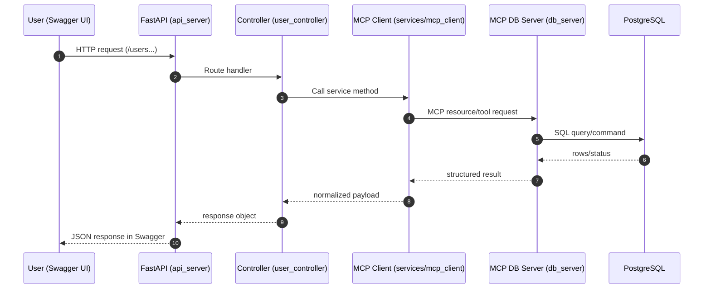

# Request Flow (Swagger -> DB -> Response)

This diagram shows how a request moves from Swagger through the API and MCP layers to PostgreSQL, then back to the client.

## Notes

- Reads are done via MCP resources (`db://users`, `db://users/{user_id}`).
- Writes are done via MCP tools (`create_user`, `update_user`, `delete_user`).
- FastAPI never talks directly to PostgreSQL; it always goes through the MCP client/server boundary.
